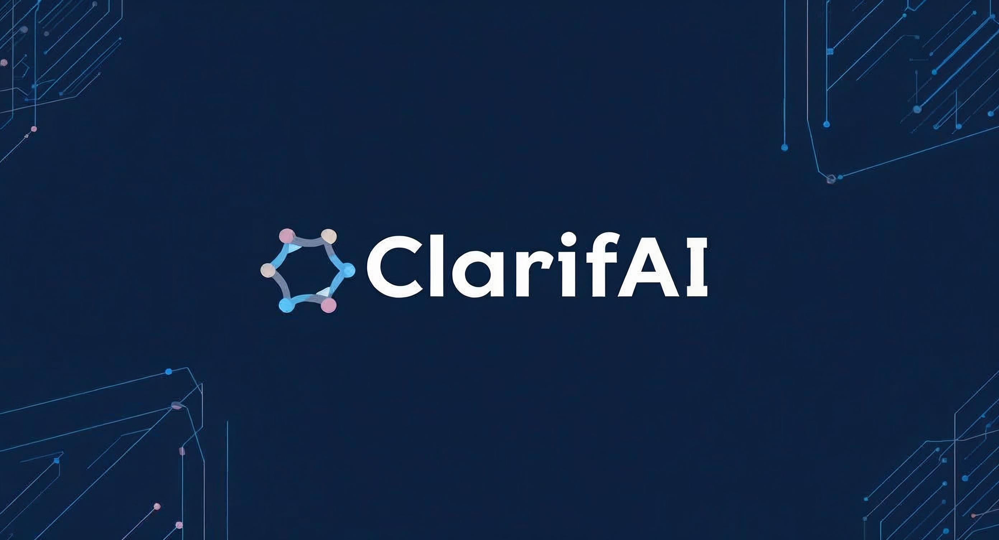

# ClarifAI - Transforming Data Chaos into Strategic Advantage 


<div align="center">


### Built with the tools and technologies:


</div>

---
<p align="center"></p>

**_A powerful, customizable tool to structure and standardize messy enterprise data with AI_**

---

## 🚀 Overview

**ClarifAI** is a data transformation engine designed to bring order to chaotic, unstructured datasets often found across industrial and enterprise environments. Born during a hackathon, ClarifAI processes non-standardized material descriptions, such as those stored in Excel sheets, into clean, structured, and usable product information.

Although our hackathon challenge focuses on material master data, ClarifAI is built to be _general-purpose_: any domain, any format, any company.

---

## 🧩 The Problem

In many companies, especially in **manufacturing, logistics, procurement**, and **mergers**, critical data are stored in free-text formats with no common structure or governance. These information:

- Come from multiple tools and departments  
- Are written by different people over time  
- Use inconsistent formats, abbreviations, and languages (often German in our case)

This leads to:

- 🌪️ Data chaos and poor data quality  
- ⌛ Slowed procurement and ERP processes  
- 🤝 Broken integrations during company mergers  
- 💸 Financial losses due to duplicates, misclassifications, and procurement errors

Real-world examples from German industry show that **data incompatibility between merged companies has caused months of delay and huge financial costs**.

---

## 💡 The Solution: ClarifAI

ClarifAI is a modular, AI-powered framework that automates the process of:

- 🧼 Cleaning and normalizing free-text material descriptions  
- 🧠 Extracting structured product fields (name, specs, type, etc.)  
- 🏷️ Suggesting standardized short descriptions under 40 characters  
- 🔍 Optionally categorizing or tagging materials  
- 💾 Exporting results back to Excel or integrated systems  

ClarifAI uses both **rule-based logic** and **local/remote Large Language Models (LLMs)** to intelligently extract key information.

---

## ⚙️ Features

| Feature | Description |
|--------|-------------|
| 🔄 **LLM + Rule-Based Hybrid** | Combines classical heuristics with local LLMs (e.g., `gemma3`) for optimal extraction |
| 📁 **Excel Input/Output** | Reads raw Excel datasets and writes clean, enriched versions |
| 🧠 **Custom Prompting** | Craft specialized prompts for better accuracy with domain-specific data |
| 🛠️ **Configurable and Open Source** | Modify rules, LLM models, or prompts to suit your company’s exact needs |
| 🧩 **Fallback Handling** | Smart fallback logic for cases where LLMs fail or text is too corrupted |
| 🇩🇪 **Optimized for German Input** | Handles typical patterns in German material data (e.g., `für`, `Pos.`, etc.) |

---

## 🔍 Example

**Input:**

```
MUFFEN-RUECKSCHLAGVENTIL // FUER SENKRECHTEN UND // WAAGRECHTEN EINBAU // R 2", PN 18, IG, MESSING // NBR-DELRIN, CA. 110 G C
```

**Output:**

```json
{
  "product_name": "MUFFEN-RUECKSCHLAGVENTIL",
  "characteristics": ["R 2\"", "NBR-DELRIN"],
  "material_type": "valve",
  "unit_of_measure": "ST",
  "categorization": {
    "Typ": "R 2\"",
    "Werkstoff": "MESSING",
    "Größe": "2\"",
    "DIN / ISO": "PN 18"
  },
  "short_description": "MUFFEN-RUECKSCHLAGVENTIL R 2\" NBR"
}
```

**Input:**

```
WELLENDICHTRING // 105X130X12 // SL/VITON // BA
```

**Output:**

```json
{
  "product_name": "WELLENDICHTRING",
  "characteristics": ["105X130X12", "VITON"],
  "material_type": "seal",
  "unit_of_measure": "ST",
  "categorization": {
    "Durchmesser innen (mm)": "105",
    "Durchmesser außen (mm)": "130",
    "Höhe (mm)": "12",
    "Werkstoff": "VITON",
    "Typ": "BA"
  },
  "short_description": "WELLENDICHTRING 105X130X12 BA"
}
```
**Input:**

```
Wirbelring 65/85-A // für Handbrenner DURAMAX 85 // passend für Plasmagerät // HYPERTHERM POWERMAX 65 // SN65-036894 / PN083235
```
**Output:**

```json
{
  "product_name": "Wirbelring",
  "characteristics": ["65/85-A", "HYPERTHERM"],
  "material_type": "ring",
  "unit_of_measure": "ST",
  "categorization": {
    "Durchmesser innen (mm)": "65",
    "Durchmesser außen (mm)": "85",
    "Fabrikat / Hersteller": "HYPERTHERM",
    "Maschinen-Nr.": "SN65-036894",
    "Zeichnung-Nr.": "PN083235"
  },
  "short_description": "Wirbelring 65/85 HYPERTHERM"
}
```
---

---

## 🔧 How It Works

### 1. Load Your Excel

```python
processor = MaterialTextProcessor("SAP_ERSA_Materialtexte_Südstärke.xlsx")
```

### 2. Process Entries

```python
processor.process_materials()
```

- Preprocesses text  
- Applies fallback heuristics  
- Calls the local LLM if needed  
- Extracts structured info and generates a standard short description  

### 3. Save Results

```python
processor.save_results("processed_materials.xlsx")
```

---

## 🧠 Tech Stack

- **Python 3.10+**  
- **pandas** for data handling  
- **fuzzywuzzy** for fuzzy matching (optional future enhancement)  
- **ollama** for local LLM integration (supports models like `gemma3`)  
- **Regex + Prompt Engineering** for semi-structured text parsing  
- Designed to work offline or connect to cloud LLM APIs  

---

## 💼 Business Value

ClarifAI solves a **critical bottleneck in digital transformation**:

- Speeds up ERP harmonization during mergers (e.g. SAP merger)
- Reduces manual data cleaning hours  
- Avoids procurement errors and duplicated parts  
- Creates a scalable pipeline for structured master data  

---

## 🔒 Deployment & Privacy

ClarifAI can be:

- **Run locally** for full data control and privacy (ideal for confidential industrial use)  
- **Extended with cloud LLMs** like OpenAI or Anthropic if higher performance is needed  
- **Integrated with internal company rules** for validation, enrichment, or taxonomy mapping  

---

## 📈 Future Features

- 📚 Fine-tuned embedding-based clustering  
- 🧮 Semi-supervised classification for unknown data  
- 🌐 Web UI for non-technical users  
- 📦 Plug-in support for different ERP formats  

---

## 🧑‍💻 Authors

Developed for Südstärke GmbH challenge, 2025 Hackathon10
